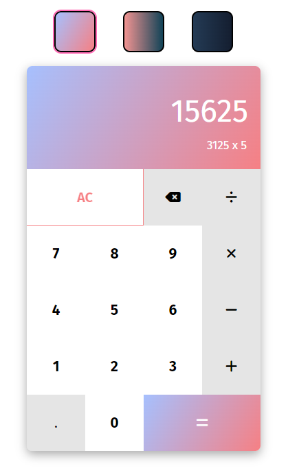

# Simple JavaScript Calculator



## Live Demo

[https://rhythm2107.github.io/calculator/](https://rhythm2107.github.io/calculator/)

## Description

This simple yet modern calculator application is built entirely with HTML, CSS, and JavaScript. Designed as part of [The Odin Project](https://www.theodinproject.com/), it provides basic arithmetic operations with a clean, user-friendly interface.

## Features

- Supports addition, subtraction, multiplication, and division operations.
- Dynamically updates and formats the calculator display for readability.
- Responsive layout with automatic font-size adjustment for lengthy calculations.
- Keyboard and mouse input support for intuitive usability.
- Built-in input validation to handle incorrect or excessive inputs gracefully.

## Technologies Used

- HTML
- CSS
- JavaScript

## How to Use

1. Clone this repository:

```bash
git clone https://github.com/yourusername/simple-calculator.git
```

2. Navigate to the project directory:

```bash
cd simple-calculator
```

3. Open `index.html` in your preferred web browser.

